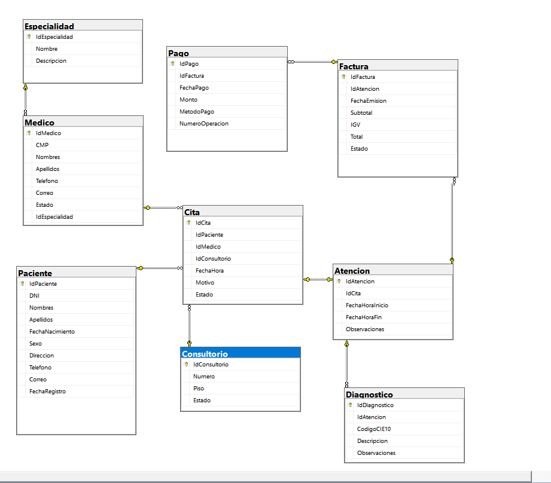

# Clínica San Rafael - Base de Datos

Proyecto de diseño e implementación de una base de datos relacional orientada a la gestión de información clínica.

Esta versión presenta de forma simplificada las principales entidades y procesos del sistema, permitiendo gestionar pacientes, médicos, especialidades, consultorios, citas, atenciones, diagnósticos, facturación y pagos.

## Tecnologías utilizadas

- SQL Server
- SQL Server Management Studio (SSMS)
- T-SQL

## Modelo de base de datos

El modelo está compuesto por 9 tablas relacionadas:

- Paciente
- Medico
- Especialidad
- Consultorio
- Cita
- Atencion
- Diagnostico
- Factura
- Pago

Se implementaron claves primarias y foráneas para mantener la integridad referencial, además de restricciones `CHECK` y `UNIQUE` para validar los datos almacenados.

### Diagrama Entidad-Relación (DER)



## Funcionalidades principales

El modelo permite representar los principales procesos de una atención clínica:

- Registro de pacientes.
- Gestión de médicos y especialidades.
- Programación de citas con médicos y consultorios.
- Registro de atenciones y diagnósticos.
- Emisión de facturas asociadas a las atenciones.
- Registro y control de pagos.

## Consultas implementadas

Se desarrollaron consultas T-SQL para obtener información relevante del sistema, entre ellas:

- Listado de citas con paciente, médico y especialidad.
- Cantidad de citas por especialidad.
- Total facturado, pagado y saldo pendiente.
- Historial de atenciones de un paciente.
- Citas programadas o confirmadas.
- Cantidad de citas atendidas por médico.
- Pacientes con más de una cita.
- Facturas con importe superior al promedio.

Las consultas utilizan operaciones como `INNER JOIN`, `LEFT JOIN`, `GROUP BY`, `HAVING`, funciones de agregación y subconsultas.

## Integridad y rendimiento

Para garantizar la consistencia y mejorar el acceso a la información se implementaron:

- Claves primarias y foráneas.
- Restricciones `CHECK`.
- Restricciones `UNIQUE`.
- Valores `DEFAULT`.
- Índices sobre campos utilizados frecuentemente en consultas.

## Estructura del repositorio

```text
database/
├── clinica_san_rafael.sql
└── queries/
    └── consultas.sql

docs/
└── DER_Clinica_San_Rafael.png
```

## Ejecución

1. Abrir SQL Server Management Studio.
2. Ejecutar `database/clinica_san_rafael.sql`.
3. El script crea la base de datos, las tablas, relaciones, restricciones, datos de prueba e índices.
4. Ejecutar `database/queries/consultas.sql` para probar las consultas desarrolladas.

## Contexto del proyecto

Este repositorio corresponde a una versión simplificada de un proyecto académico de gestión clínica, preparada para mostrar los principales componentes del diseño e implementación de una base de datos relacional.
